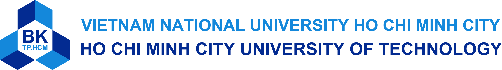

<!--  -->

<h1 align="center">Hello World! I'm Anh Duc 👋🏼</h1>

AI should not only think, 
but perceive, reason, and act in the physical world.

  

###

Currently, I am a Computer Science student at [Ho Chi Minh City University of Technology](https://hcmut.edu.vn/).

Exploring AI research and engineering, with a focus on agentic AI, autonomous systems, and embodied intelligence.

Interested in developing scalable AI solutions, from LLM/SLM pipelines to real-world applications in computer vision, smart environments, and real-time interaction systems.

Continuously improving through research, hands-on projects, and applying deep learning to practical challenges.

💬 Let's connect!

###

# Stack

Python • C++ • Java • SQL • Bash

PyTorch • TensorFlow • YOLO • HuggingFace • scikit-learn

FastAPI • MongoDB • MySQL • Docker • AWS • GCP

Git • Linux • SSH • Grafana • Postman • Cloudflare

###

# Current Interests

* Embodied Intelligence
* Autonomous AI Systems
* Multi-Agent Orchestration
* Edge AI & Robotics
* Real-time AI Infrastructure
* Smart Environments
* Human-AI Interaction

###

# ⚡️ Where to find me

  

